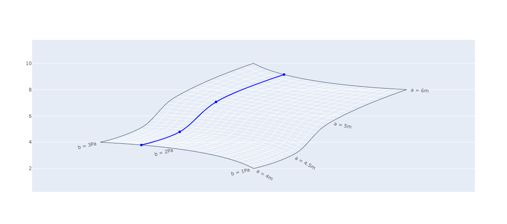

## 🔖 Sobre
Para esse trabalho utilizamos como fonte de estudo de Data Visualization ministrado pelo professor [Ashwin Pajankar](https://www.udemy.com/course/python-scientific-visualizations-with-plotly/), desenvolvemos diversos tipos de gráficos para apoiar projetos de Ciência de Dados. O principal intuito é utilizar esse projeto como fonte de pesquisa para trabalho voltados a aplicação de Data Science.

</br>

<p align="center"> 
  
</p>

</br>

## 🚀 Bibliotecas utilizadas

- [Plotly](https://plotly.com/)
- [Numpy](https://numpy.org/)
- [Matplotlib](https://matplotlib.org/)
- [Pandas](https://pandas.pydata.org/)

</br>

## 🗂 Como baixar e iniciar o projeto

```bash
# Abra um terminal e copie este repositório com o comando
$ git clone https://github.com/cbvreis/data-visualization-plotly.git
# ou use a opção de download.

pip install -r requirements.txt

# Entrar no diretorio **/data-visualization**
$ cd data-visualization
```

<br>

Desenvolvido por [Cássio Reis](https://www.linkedin.com/in/cassioreisdevelop/) 🤓

